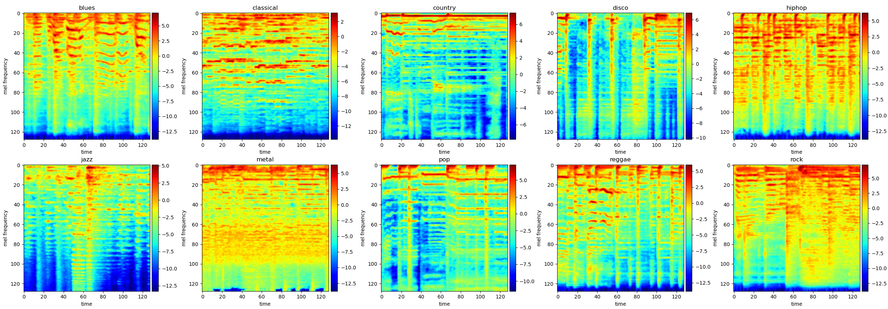

# SpeechRecognition

## CTCR

Phoneme Prediction - Connectionist Temporal Classification RNN

```text
Say...
Record.
['sil', 'h', 'o', 'h', 'i', 'cl', 'ch', 'i', 'e', 'o', 'a', 'sil']
```

## MGCC

Genre Classification - Music Genre Classification CNN

<p aling="center">
  
</p>

## STTT

 - 
